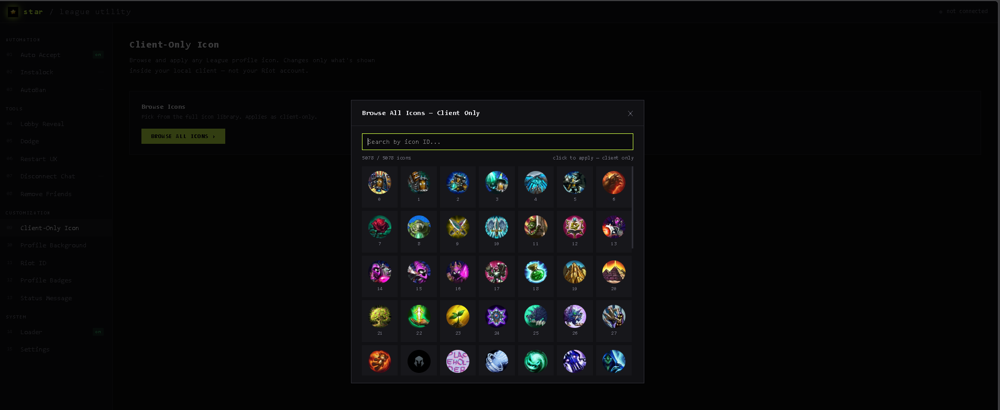
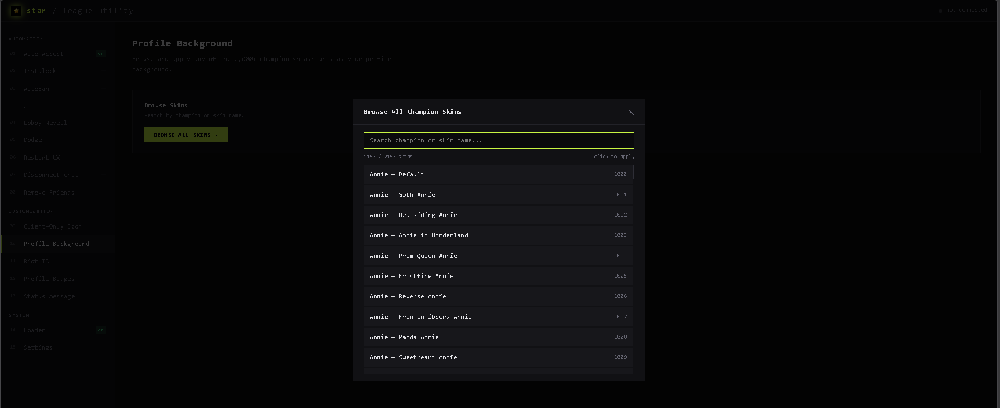

<div align="center">




**A local League of Legends client utility with a clean web UI.**  
Auto accept, instalock, autoban, profile customization, plugin loader, and more.

</div>

---

## Requirements

- Python 3.10+
- League of Legends running in the background

---

## Quick Start (EXE)

No Python needed. Download `star.exe` from the [Releases](../../releases) page, drop it anywhere, double-click.

> Windows may show a SmartScreen warning — click **More info → Run anyway**. This is expected for unsigned executables.

---

## Run from Source

```bash
pip install -r requirements.txt
python app.py
```

The app starts a local server and opens `http://localhost:5199` in your browser automatically.  
The status dot in the top-right turns green once it detects your League client.

---

## Build EXE yourself

Requires Python 3.10+ and pip.

```bash
pip install pyinstaller
python -m PyInstaller --onefile --name star --icon star2.png ^
  --add-data "templates;templates" ^
  --add-data "static;static" ^
  --add-data "plugins;plugins" ^
  --add-data "star1.png;." ^
  --add-data "star2.png;." ^
  app.py
```

Or just run `build_exe.bat` — output will be in `dist\star.exe`.

---

## Features

**Tools**
| Feature | Description |
|---|---|
| Auto Accept | Instantly accepts match found pop-ups |
| Instalock | Locks your champion automatically during pick phase |
| AutoBan | Bans your chosen champion automatically during ban phase |
| Lobby Reveal | Opens all players in your lobby on Porofessor / OP.GG / U.GG |
| Dodge Lobby | Leaves champion select without closing the client |
| Restart Client UX | Reloads the League UI without closing the game |
| Appear Offline | Disconnects chat so you appear offline to friends |
| Remove All Friends | Purges your entire friend list |
| Rage Queue | Automatically re-queues and re-searches after a game ends. Supports all queue types (Ranked Solo/Duo, Flex, ARAM, TFT, etc.) and lane preferences. Set it once, it handles the rest. |
| Draft Helper | Suggests best picks for your role based on live Lolalytics tier list data combined with your champion mastery. Shows comfort picks (champs you know) and best picks (highest winrate / counter score vs enemy picks). Auto-refreshes during champ select. ⚠️ Work in progress — may not work in all situations. |

**Customization**
| Feature | Description |
|---|---|
| Profile Icon | Browse all icons and apply with one click |
| Client-Only Icon | Change icon visible only inside your local client |
| Profile Background | Browse 2,000+ champion splash arts |
| Riot ID | Update your game name and tag |
| Profile Badges | Clear, duplicate, or glitch badge slots |
| Status Message | Set a custom status visible to friends |

**Loader**
| Feature | Description |
|---|---|
| Plugin Manager | Enable or disable `.js` plugins from `star/plugins/` without touching files |
| Plugin Folder | Quick-open the plugins directory from the UI |

> **Note:** DLL install is temporarily unavailable — will be fixed in the next update. CDP-based plugin injection (used by the plugin manager) works normally.

**Settings**
- Night / Light theme
- Lobby reveal provider (Porofessor, OP.GG, U.GG)
- Per-feature automation delays (Auto Accept, Instalock, AutoBan)
- Riot Client auto-launch on star startup

---

## Plugins

Drop `.js` files or plugin folders (containing `index.js`) into `star/plugins/`.  
Toggle plugins on/off from the Loader tab — no need to rename files manually.  
Disabled plugins are stored with a `.js_` extension.

---

## Notes

- `config.json` saves your settings locally (see `config.json.example` for the format)
- Icon and skin browsers fetch data from [CommunityDragon](https://communitydragon.org/) on first load
- All automation runs locally — nothing is sent externally
- Install is manual only — star does not auto-install or modify League files while it's running

---

## Troubleshooting

**Not connecting** — Make sure League is open and you're logged in. The app polls every 2 seconds.

**pip install fails** — Use a virtual environment:
```bash
python -m venv venv
venv\Scripts\activate    # Windows
source venv/bin/activate # Mac/Linux
pip install -r requirements.txt
```

**Port in use** — Change the port at the bottom of `app.py`:
```python
app.run(host='0.0.0.0', port=5199, ...)
```

---

<div align="center">

Based on [tiamat](https://github.com/369gabriel/tiamat)  
Remade with Claude :]

</div>
